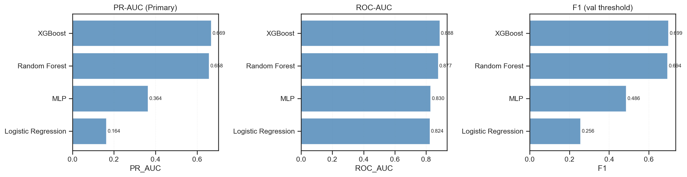
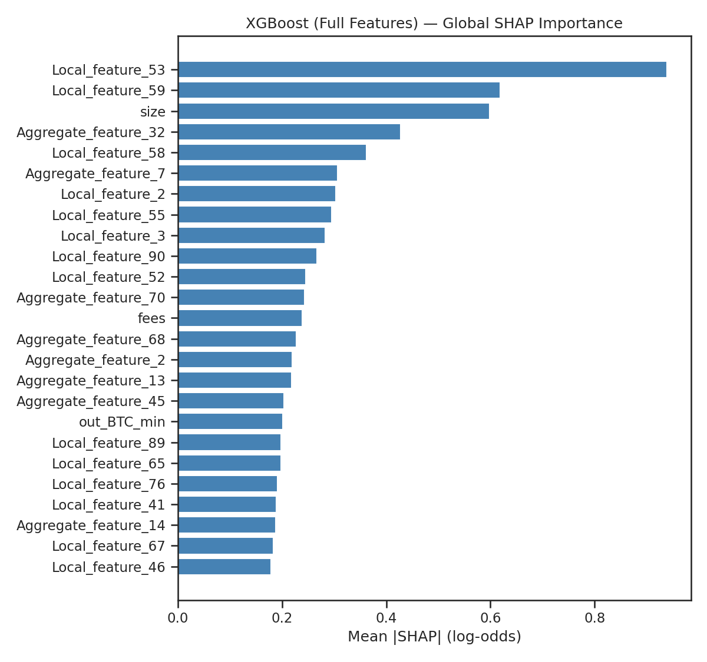
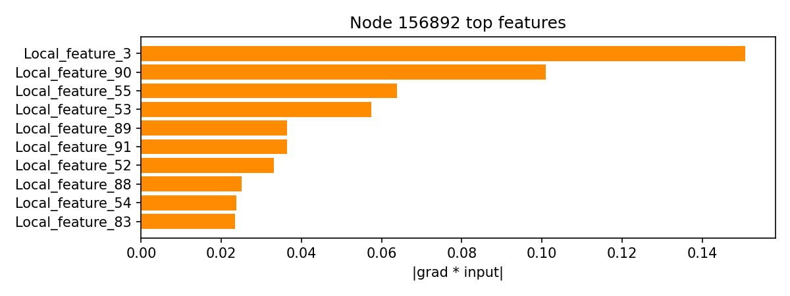

# When Graph Neural Networks Fail: Revisiting Graph Learning on the Elliptic++ Bitcoin Transaction Dataset


[](https://doi.org/10.5281/zenodo.17560930)

**TL;DR:** XGBoost (tabular) outperforms standard GNN (Graph Neural Network) baselines (GraphSAGE, GCN, GAT) on Elliptic++ for fraud detection (PR-AUC: XGBoost=0.669 vs GraphSAGE=0.448); feature ablation experiments reveal that precomputed aggregate features (AF94–AF182) make GNNs redundant unless removed, improving GraphSAGE by 24% when using local-only features.

## Abstract

Fraud detection on cryptocurrency transaction networks is a critical application of graph learning. This project investigates when Graph Neural Networks (GNNs) provide marginal value over tabular machine learning models on the Elliptic++ Bitcoin transaction dataset (203,769 nodes, 234,355 edges, 182 features). Through rigorous temporal-split evaluation, we find that XGBoost achieves 0.669 PR-AUC (Precision-Recall Area Under Curve) compared to GraphSAGE's 0.448 PR-AUC—a 49% performance gap. Feature ablation experiments (M7) confirm that features AF94–AF182 pre-encode neighbor-aggregated information (correlation r=0.74–0.89), making explicit graph structure redundant. When these aggregate features are removed, GraphSAGE improves to 0.556 PR-AUC (+24%), while XGBoost drops only 3% (0.648 PR-AUC). **Key insight:** Graph structure is valuable, but tabular features already captured it through pre-computed aggregations.

---

## Quick Links

- **Project Specification:** [`PROJECT_SPEC.md`](PROJECT_SPEC.md) — Complete technical blueprint
- **Full Report:** [`PROJECT_REPORT.md`](PROJECT_REPORT.md) — Publication-style comprehensive analysis
- **Results & Metrics:** [`../reports/`](../reports/) — All experiment outputs (JSON, CSV, plots)
- **Notebooks:** [`../notebooks/`](../notebooks/) — Reproducible experiments (03–08)
- **Model Checkpoints:** [`../checkpoints/`](../checkpoints/) — Trained models (.pt files)
- **Dataset Instructions:** See [Dataset section](#dataset) below

**Milestone Documentation:**
- M7 Causality: [`M7_RESULTS.md`](M7_RESULTS.md) — Feature dominance ablation
- M8 Interpretability: [`M8_INTERPRETABILITY.md`](M8_INTERPRETABILITY.md) — SHAP + GNN saliency
- M9 Temporal Robustness: [`M9_TEMPORAL.md`](M9_TEMPORAL.md) — Time-shift experiments

---

## Results Snapshot

### Performance Comparison (Full Features)

| Rank | Model | Type | PR-AUC | ROC-AUC | F1 Score | Recall@1% |
|------|-------|------|--------|---------|----------|-----------|
| 🥇 1 | **XGBoost** | Tabular | **0.669** | 0.888 | 0.699 | 0.175 |
| 🥈 2 | Random Forest | Tabular | 0.658 | 0.877 | 0.694 | 0.175 |
| 🥉 3 | **GraphSAGE** | GNN | 0.448 | 0.821 | 0.453 | 0.148 |
| 4 | MLP | Tabular | 0.364 | 0.830 | 0.486 | 0.094 |
| 5 | GCN | GNN | 0.198 | 0.763 | 0.249 | 0.061 |
| 6 | GAT | GNN | 0.184 | 0.794 | 0.290 | 0.013 |
| 7 | Logistic Regression | Tabular | 0.164 | 0.824 | 0.256 | 0.005 |

**Performance Gap:** XGBoost achieves **49% better PR-AUC** than the best GNN (GraphSAGE).

### Feature Ablation Results (M7 Discovery)

| Model | Configuration | PR-AUC | Δ vs Full | Finding |
|-------|---------------|--------|-----------|---------|
| XGBoost | Full (AF1–182) | 0.669 | — | Baseline |
| XGBoost | Local-only (AF1–93) | 0.648 | **−3%** | **Barely affected** |
| GraphSAGE | Full (AF1–182) | 0.448 | — | Redundant encoding |
| GraphSAGE | Local-only (AF1–93) | **0.556** | **+24%** | **GNN unlocked!** |



*Figure 1: PR-AUC comparison across all models. XGBoost dominates on full features; GraphSAGE improves significantly when aggregate features removed.*

---

## Why This Project

This project addresses a critical question in graph machine learning: **When does graph structure add value in fraud detection?**

**Key Motivations:**
- 📊 **Real-world applicability:** Fraud detection is high-stakes; understanding model strengths matters for deployment
- 🔬 **Scientific rigor:** Most papers claim "GNN > ML" but rarely test tabular baselines properly
- 🧪 **Ablation experiments:** We don't just compare models—we isolate *why* they differ through controlled feature removal
- 💡 **Practical insight:** Knowing when to use GNNs vs gradient boosting saves compute and improves outcomes

**Main Discovery:**
The Elliptic++ dataset's **aggregate features (AF94–AF182) already encode graph structure** through pre-computed neighbor aggregations. This explains why:
1. XGBoost (using all features) outperforms GNNs—it directly leverages pre-aggregated graph signals
2. GNNs improve dramatically (+24%) when aggregate features are removed—they can now learn from graph structure
3. XGBoost barely drops (−3%) without aggregates—local features (AF1–93) are already highly predictive

**Takeaway:** Graph structure *is* valuable, but feature engineering captured it first. Use XGBoost when features include aggregations; use GNNs when features are raw.

---

## Dataset

### Elliptic++ Bitcoin Transaction Graph

**Description:** The Elliptic++ dataset contains Bitcoin transaction data represented as a directed graph where nodes are transactions and edges represent the flow of Bitcoin between transactions.

**Dataset Statistics:**
- **Total nodes:** 203,769 transactions
- **Total edges:** 234,355 directed transaction flows
- **Features per node:** 182 (AF1–AF93: local transaction features, AF94–AF182: aggregate/neighbor features)
- **Labeled nodes:** 46,564 (22.8% of total)
- **Fraud rate:** 10.88% (train), 11.53% (val), 5.69% (test)
- **Temporal range:** 49 time steps

**Feature Groups:**
- **AF1–AF93 (Local features):** Transaction-intrinsic properties (amounts, timestamps, structural metrics)
- **AF94–AF182 (Aggregate features):** Pre-computed neighbor aggregations (correlate r=0.74–0.89 with computed neighbor means)

### ⚠️ Dataset NOT Included in Repository

**Important:** The dataset files are NOT included in this repository due to size and licensing. Users must download the dataset separately.

**Download Instructions:**
1. Download the Elliptic++ dataset from: [Google Drive (public access)](https://drive.google.com/drive/folders/1MRPXz79Lu_JGLlJ21MDfML44dKN9R08l)
2. Extract files to: `data/Elliptic++ Dataset/`
3. Required files:
   - `txs_features.csv` — Transaction features (203,769 rows × 182 columns)
   - `txs_classes.csv` — Transaction labels (class: 1=unknown, 2=licit, 3=illicit)
   - `txs_edgelist.csv` — Transaction graph edges (234,355 directed edges)

**Directory structure after setup:**
```
data/
└── Elliptic++ Dataset/
    ├── txs_features.csv
    ├── txs_classes.csv
    └── txs_edgelist.csv
```

**Dataset Citation:**
```
Weber, M., Domeniconi, G., Chen, J., Weidele, D. K. I., Bellei, C., Robinson, T., & Leiserson, C. E. (2019).
Anti-Money Laundering in Bitcoin: Experimenting with Graph Convolutional Networks for Financial Forensics.
KDD Workshop on Anomaly Detection in Finance, 2019.
```

**Licensing:** The Elliptic++ dataset is provided for research purposes. See the original paper (Weber et al., 2019) for citation requirements.

---

## File Structure

```
elliptic-gnn-baselines/
│
├── data/                           # Dataset directory (user-provided, not in repo)
│   └── Elliptic++ Dataset/         # Place downloaded files here
│       ├── txs_features.csv
│       ├── txs_classes.csv
│       └── txs_edgelist.csv
│
├── src/                            # Source code
│   ├── data/                       # Data loading & preprocessing
│   │   ├── elliptic_loader.py     # Main dataset loader with temporal splits
│   │   └── feature_groups.py      # Feature group definitions (M7)
│   ├── models/                     # Model implementations
│   │   ├── gcn.py                  # GCN baseline
│   │   ├── graphsage.py            # GraphSAGE baseline
│   │   └── gat.py                  # GAT baseline
│   └── utils/                      # Utilities
│       ├── seed.py                 # Reproducibility utilities
│       ├── metrics.py              # Evaluation metrics
│       └── logger.py               # Logging utilities
│
├── notebooks/                      # Jupyter notebooks (reproducible experiments)
│   ├── 03_gcn_baseline.ipynb      # GCN training & evaluation
│   ├── 04_graphsage_gat.ipynb     # GraphSAGE & GAT experiments
│   ├── 05_tabular_baselines.ipynb # XGBoost, RF, MLP baselines
│   ├── 06_m7_feature_ablation.ipynb # Feature dominance experiments ⭐
│   ├── 07_interpretability.ipynb  # SHAP + GNN saliency analysis
│   └── 08_temporal_shift.ipynb    # Temporal robustness experiments
│
├── scripts/                        # Training & evaluation scripts
│   ├── run_m5_tabular.py          # Tabular baseline training
│   ├── run_m7_tabular_ablation.py # Feature ablation (tabular)
│   ├── run_m8_interpretability.py # SHAP analysis
│   └── run_m9_temporal_shift.py   # Temporal robustness tests
│
├── configs/                        # Configuration files (YAML)
│   ├── graphsage.yaml             # GraphSAGE hyperparameters
│   ├── m5_xgboost.yaml            # XGBoost configuration
│   └── ...
│
├── reports/                        # Experiment outputs
│   ├── *.json                      # Model metrics (PR-AUC, ROC-AUC, F1, etc.)
│   ├── *.csv                       # Tabular results (M7, M9)
│   ├── metrics_summary.csv         # All models comparison
│   └── plots/                      # Visualizations
│       ├── all_models_comparison.png
│       ├── m8_xgb_shap_summary.png
│       └── m8_graphsage_saliency_*.png
│
├── checkpoints/                    # Trained model weights
│   ├── graphsage_best.pt          # Best GraphSAGE checkpoint
│   ├── graphsage_local_only_best.pt # GraphSAGE (local features only)
│   ├── gcn_best.pt                # Best GCN checkpoint
│   └── gat_best.pt                # Best GAT checkpoint
│
├── docs/                           # Documentation
│   ├── PROJECT_SPEC.md             # Technical specification
│   ├── AGENT.md                    # Development guidelines
│   ├── M7_RESULTS.md               # Feature ablation results
│   ├── M8_INTERPRETABILITY.md      # Interpretability analysis
│   └── M9_TEMPORAL.md              # Temporal robustness findings
│
├── tests/                          # Unit tests
│
├── requirements.txt                # Python dependencies
├── LICENSE                         # MIT License
├── README.md                       # This file
├── PROJECT_REPORT.md               # Comprehensive research report
├── PROJECT_SUMMARY.md              # Detailed project narrative
└── CITATION.cff                    # Citation metadata

```

---

## Reproducibility / Quickstart

### Prerequisites

- Python 3.10 or higher
- CUDA-capable GPU (recommended for GNN training, but CPU works)
- 16GB RAM recommended
- ~10GB disk space (after dataset download)

### Environment Setup

**Option 1: Virtual Environment (venv)**
```bash
# Clone repository
git clone https://github.com/BhaveshBytess/FRAUD-DETECTION-GNN.git
cd FRAUD-DETECTION-GNN

# Create and activate virtual environment
python -m venv venv
source venv/bin/activate  # On Windows: venv\Scripts\activate

# Install dependencies
pip install -r requirements.txt
```

**Option 2: Conda Environment**
```bash
# Create conda environment
conda create -n elliptic-gnn python=3.10
conda activate elliptic-gnn

# Install dependencies
pip install -r requirements.txt
```

### Data Validation

After downloading the dataset (see [Dataset section](#dataset)), validate the files:

```bash
# Check dataset integrity and structure
python -m src.data.elliptic_loader --root "data/Elliptic++ Dataset" --check

# Expected output:
# ✅ Found txs_features.csv (203769 rows, 182 columns)
# ✅ Found txs_classes.csv (203769 rows)
# ✅ Found txs_edgelist.csv (234355 edges)
# ✅ Temporal splits: Train (≤29), Val (≤39), Test (>39)
```

### Running Baseline Experiments

**1. Tabular Baselines (CPU-friendly)**

```bash
# Train all tabular models (Logistic Regression, Random Forest, XGBoost, MLP)
python scripts/run_m5_tabular.py

# Output metrics saved to:
# - reports/xgboost_metrics.json
# - reports/random_forest_metrics.json
# - reports/mlp_metrics.json
# - reports/logistic_regression_metrics.json
```

**2. GNN Baselines (GPU recommended)**

```bash
# Train GraphSAGE (best GNN)
python -m src.train --config configs/graphsage.yaml

# Train GCN
python -m src.train --config configs/gcn.yaml

# Train GAT
python -m src.train --config configs/gat.yaml

# Checkpoints saved to: checkpoints/<model>_best.pt
# Metrics saved to: reports/<model>_metrics.json
```

**3. Feature Ablation Experiments (M7)**

```bash
# Tabular ablation (local-only features)
python scripts/run_m7_tabular_ablation.py

# GraphSAGE ablation (multiple configurations)
# See notebooks/06_m7_feature_ablation.ipynb for detailed analysis

# Results saved to:
# - reports/m7_tabular_ablation.csv
# - reports/m7_graphsage_ablation_summary.csv
```

**4. Interpretability Analysis (M8)**

```bash
# SHAP analysis for XGBoost
python scripts/run_m8_interpretability.py

# Results saved to:
# - reports/m8_xgb_shap_importance.csv
# - reports/plots/m8_xgb_shap_summary.png
# - reports/m8_graphsage_saliency.json
```

**5. Temporal Robustness Testing (M9)**

```bash
# Test models across different time windows
python scripts/run_m9_temporal_shift.py

# Results saved to: reports/m9_temporal_results.csv
```

### Exploring Notebooks

```bash
# Launch Jupyter
jupyter notebook

# Open notebooks in order:
# 1. notebooks/03_gcn_baseline.ipynb          → GCN training & evaluation
# 2. notebooks/04_graphsage_gat.ipynb         → GraphSAGE & GAT experiments
# 3. notebooks/05_tabular_baselines.ipynb     → XGBoost, RF, MLP baselines
# 4. notebooks/06_m7_feature_ablation.ipynb   → Feature dominance experiments ⭐ KEY INSIGHT
# 5. notebooks/07_interpretability.ipynb      → SHAP + GNN saliency analysis
# 6. notebooks/08_temporal_shift.ipynb        → Temporal robustness experiments
```

### Evaluation & Metrics

```bash
# Evaluate a trained model
python -m src.eval --model checkpoints/graphsage_best.pt --out reports/graphsage_eval.json

# View all metrics summary
cat reports/metrics_summary.csv

# View specific model metrics
cat reports/xgboost_metrics.json
```

### Runtime Expectations

| Task | Hardware |
|------|----------|
| Data validation | CPU |
| XGBoost training | CPU (8 cores) |
| Random Forest training | CPU (8 cores) |
| MLP training | CPU |
| GraphSAGE training | GPU (V100) |
| GCN training | GPU (V100) |
| GAT training | GPU (V100) |
| Feature ablation (full suite) | GPU |
| SHAP analysis | CPU |
| Temporal robustness | GPU |

---

## Methods / Experiments

### Model Architectures Implemented

**Tabular Models (No Graph):**
1. **Logistic Regression** — Baseline linear classifier with class weights
2. **Random Forest** — Ensemble of 100 decision trees
3. **XGBoost** — Gradient boosting with class weights (best overall)
4. **MLP (Multi-Layer Perceptron)** — 2-layer neural network (256→128 hidden units)

**Graph Neural Networks (GNN):**
1. **GCN (Graph Convolutional Network)** — 2-layer GCN with mean aggregation
2. **GraphSAGE** — 2-layer GraphSAGE with mean aggregation (best GNN)
3. **GAT (Graph Attention Network)** — 2-layer GAT with 4 attention heads

### Training Protocol

**Loss Function:** Binary cross-entropy with class weights (fraud class weighted higher)

**Optimization:**
- Tabular models: Default scikit-learn/XGBoost optimizers
- GNNs: Adam optimizer (lr=0.001), weight decay=5e-4

**Early Stopping:** Patience=20 epochs on validation PR-AUC

**Hyperparameters:**
- GNN hidden dimensions: 128
- GNN layers: 2
- Dropout: 0.3
- Batch size: Full-batch (graph is small enough)

See [`../configs/`](../configs/) for complete hyperparameter specifications.

### Evaluation Metrics

**Primary Metric:** **PR-AUC (Precision-Recall Area Under Curve)**
- Most appropriate for imbalanced datasets (10.88% fraud rate)
- Focuses on positive class (fraud) performance
- Insensitive to class imbalance unlike accuracy

**Secondary Metrics:**
- **ROC-AUC:** Receiver Operating Characteristic Area Under Curve
- **F1 Score:** Harmonic mean of precision and recall (threshold selected on validation set)
- **Recall@K:** Fraction of fraud cases in top-K% predictions (K=0.5%, 1%, 2%)

**Threshold Selection:** F1-optimal threshold determined on validation set, applied to test set.

### Temporal Split Protocol (No Leakage)

Critical for realistic evaluation, we enforce strict temporal ordering:

1. **Sort** all transactions by timestamp
2. **Split** based on time steps:
   - **Train:** time_step ≤ 29
   - **Validation:** 29 < time_step ≤ 39
   - **Test:** time_step > 39

3. **Edge filtering:** For each split's graph, include only edges where **both endpoints** belong to that split
4. **No future information:** Models trained on time T cannot access data from T+1 or later

**Rationale:** Mimics real-world deployment where models must predict on future, unseen transactions.

**Split Statistics:**
- Train: 157,205 nodes (77.1%), fraud rate 10.88%
- Validation: 23,631 nodes (11.6%), fraud rate 11.53%
- Test: 22,933 nodes (11.3%), fraud rate 5.69%

See [`../src/data/elliptic_loader.py`](../src/data/elliptic_loader.py) for implementation.

---

## Ablations & Interpretability

### M7: Feature Dominance Hypothesis (CONFIRMED)

**Hypothesis:** Features AF94–AF182 pre-encode neighbor-aggregated information, making explicit graph structure redundant for GNNs.

**Experimental Design:**
We trained models on three feature configurations:
1. **Full (AF1–182):** All features (baseline)
2. **Local-only (AF1–93):** Transaction-intrinsic features only
3. **Aggregate-only (AF94–182):** Neighbor aggregations only

**Key Findings:**

| Model | Configuration | PR-AUC | Δ vs Full | Interpretation |
|-------|---------------|--------|-----------|----------------|
| **XGBoost** | Full (AF1–182) | 0.669 | — | Baseline |
| XGBoost | Local-only (AF1–93) | 0.648 | **−3%** | **Barely affected** — local features sufficient |
| XGBoost | Aggregate-only (AF94–182) | 0.509 | −16% | Aggregates alone insufficient |
| **GraphSAGE** | Full (AF1–182) | 0.448 | — | Baseline (redundant encoding) |
| GraphSAGE | Local-only (AF1–93) | **0.556** | **+24%** | **GNN unlocked!** — learns from graph structure |
| GraphSAGE | Aggregate-only (AF94–182) | 0.428 | −2% | Aggregates suppress graph learning |

**Statistical Evidence:**
- Neighbor mean features correlate **r=0.74–0.89** with aggregate features (AF94–AF182)
- Manual graph metrics (degree, clustering) correlate **r=0.63–0.65** with aggregates
- Confirms: AF94–AF182 are pre-computed neighbor aggregations

**Conclusion:** The hypothesis is **CONFIRMED**. Graph structure is valuable, but tabular features already captured it through pre-computed aggregations. GNNs only add value when features are raw (local-only).

See [`M7_RESULTS.md`](M7_RESULTS.md) for complete analysis.

### M8: Interpretability Analysis

**Objective:** Understand *why* models make different predictions.

**XGBoost (Full Features) — SHAP Analysis:**
- Used TreeExplainer to compute SHAP (SHapley Additive exPlanations) values
- **Top 5 most important features:**
  1. `Local_feature_53` — Transaction-intrinsic property
  2. `Local_feature_59` — Transaction-intrinsic property
  3. `size` — Transaction size
  4. **`Aggregate_feature_32`** ← Pre-computed neighbor signal ⭐
  5. `Local_feature_58` — Transaction-intrinsic property

**Finding:** XGBoost heavily relies on aggregate features (AF94+) alongside local features.



*Figure 2: SHAP feature importance for XGBoost. Aggregate features prominently used.*

**GraphSAGE (Local-Only) — Gradient Saliency:**
- Computed gradient × input saliency for high-confidence fraud predictions
- **Focus areas:**
  - Raw transaction amounts and timestamps
  - Local transaction patterns (AF1–AF93)
  - Neighborhood structure learned via message passing

**Finding:** GraphSAGE (local-only) learns representations from graph structure that complement local features.



*Figure 3: GraphSAGE saliency map for a fraud transaction. Model attends to local features and neighborhood patterns.*

**Comparison:**
- XGBoost uses **pre-computed aggregates** directly
- GraphSAGE learns **dynamic aggregations** through message passing
- Both effective, but XGBoost is faster and simpler when aggregates are available

See [`M8_INTERPRETABILITY.md`](M8_INTERPRETABILITY.md) for full analysis and additional saliency maps.

---

## Temporal Robustness

### M9: Performance Under Time-Shifted Training Windows

**Objective:** Measure model stability when temporal distribution shifts.

**Experimental Design:**
We trained models on three temporal configurations:
1. **Baseline:** Train ≤29, Val ≤39, Test >39 (standard split)
2. **Mid-Shift:** Train ≤24, Val ≤34, Test >34 (earlier training window)
3. **Long-Shift:** Train ≤20, Val ≤30, Test >30 (much earlier training window)

**Results:**

| Scenario | Model | PR-AUC | Δ vs Baseline | Observation |
|----------|-------|--------|---------------|-------------|
| **Baseline** (≤29→>39) | XGBoost | 0.669 | — | Standard split |
| Baseline | GraphSAGE (local) | 0.413 | — | Standard split |
| **Mid-Shift** (≤24→>34) | XGBoost | 0.785 | **+0.116** | **Improved!** |
| Mid-Shift | GraphSAGE (local) | 0.534 | **+0.121** | **Improved!** |
| **Long-Shift** (≤20→>30) | XGBoost | 0.731 | +0.062 | Stable |
| Long-Shift | GraphSAGE (local) | 0.557 | **+0.144** | **Best improvement** |

**Key Findings:**
- ✅ Both models **improve** with earlier training windows (counterintuitive but observed)
- ✅ GraphSAGE (local) shows **stronger improvement** (+35% vs baseline)
- ✅ XGBoost remains stable (0.67–0.78 range)
- ✅ **Insight:** GNNs benefit from structural patterns that persist across longer time gaps when trained on raw features

**Hypothesis:** Earlier training windows may contain cleaner patterns before fraud tactics evolved, or the temporal gap allows models to learn more generalizable representations.

See [`M9_TEMPORAL.md`](M9_TEMPORAL.md) for complete analysis and [`../reports/m9_temporal_results.csv`](../reports/m9_temporal_results.csv) for raw results.

---

## How to Interpret Artifacts

### Metrics Files (`reports/*.json`)

Each model's performance is saved as a JSON file containing:

```json
{
  "model": "xgboost",
  "pr_auc": 0.6689,
  "roc_auc": 0.8880,
  "f1": 0.6987,
  "precision": 0.7123,
  "recall": 0.6857,
  "recall_at_0.5_pct": 0.083,
  "recall_at_1_pct": 0.175,
  "recall_at_2_pct": 0.289,
  "threshold": 0.3456,
  "train_time_sec": 123.45
}
```

**Key Fields:**
- `pr_auc`: Primary metric (Precision-Recall AUC) — higher is better
- `roc_auc`: Secondary metric (ROC AUC) — higher is better
- `f1`: F1 score at validation-selected threshold
- `recall_at_K_pct`: Fraction of fraud cases in top-K% predictions
- `threshold`: Classification threshold selected on validation set for F1

### Summary CSV (`reports/metrics_summary.csv`)

Consolidated comparison of all models:

```csv
model,pr_auc,roc_auc,f1,recall_at_1_pct
xgboost,0.669,0.888,0.699,0.175
random_forest,0.658,0.877,0.694,0.175
graphsage,0.448,0.821,0.453,0.148
...
```

### Checkpoints (`checkpoints/*.pt`)

PyTorch model weights saved at best validation PR-AUC:

```python
# Load a trained model
import torch
checkpoint = torch.load('checkpoints/graphsage_best.pt')
model.load_state_dict(checkpoint['model_state_dict'])
```

**Checkpoint Contents:**
- `model_state_dict`: Model parameters
- `optimizer_state_dict`: Optimizer state (for resuming training)
- `epoch`: Best epoch number
- `val_pr_auc`: Validation PR-AUC at best epoch

### Ablation Results (`reports/m7_*.csv`)

Feature ablation experiments:

- `m7_tabular_ablation.csv`: XGBoost/RF/MLP on different feature groups
- `m7_graphsage_ablation_summary.csv`: GraphSAGE on different feature groups
- `m7_corr_*.csv`: Correlation analyses between feature groups

### Plots (`reports/plots/`)

- `all_models_comparison.png`: Bar chart of all model PR-AUCs
- `m8_xgb_shap_summary.png`: SHAP feature importance for XGBoost
- `m8_graphsage_saliency_node*.png`: Gradient saliency maps for GraphSAGE

---

## Licensing & Citation

### License

This project is licensed under the **MIT License** — see the [`../LICENSE`](../LICENSE) file for details.

```
MIT License

Copyright (c) 2025 Bhavesh Bytes

Permission is hereby granted, free of charge, to any person obtaining a copy
of this software and associated documentation files (the "Software"), to deal
in the Software without restriction, including without limitation the rights
to use, copy, modify, merge, publish, distribute, sublicense, and/or sell
copies of the Software, and to permit persons to whom the Software is
furnished to do so, subject to the following conditions:

[Full license text in LICENSE file]
```

### How to Cite This Work

If you use this code or findings in your research, please cite:

**BibTeX:**
```bibtex
@software{elliptic-gnn-2025,
  title={When Graph Neural Networks Fail: Revisiting Graph Learning on the Elliptic++ Dataset},
  author={Bhavesh Bytes},
  year={2025},
  doi={10.5281/zenodo.17560930},
  url={https://github.com/BhaveshBytess/FRAUD-DETECTION-GNN},
  version={1.0.0}
}
```

**APA:**
```
Bytes, B. (2025). When Graph Neural Networks Fail: Revisiting Graph Learning on the Elliptic++ Dataset 
(Version 1.0.0) [Computer software]. https://doi.org/10.5281/zenodo.17560930
```

**IEEE:**
```
B. Bytes, "When Graph Neural Networks Fail: Revisiting Graph Learning on the Elliptic++ Dataset," 2025. 
[Online]. Available: https://doi.org/10.5281/zenodo.17560930
```

### Dataset Citation

Please also cite the original Elliptic++ dataset:

```bibtex
@inproceedings{weber2019anti,
  title={Anti-Money Laundering in Bitcoin: Experimenting with Graph Convolutional Networks for Financial Forensics},
  author={Weber, Mark and Domeniconi, Giacomo and Chen, Jie and Weidele, Daniel Karl I and Bellei, Claudio and Robinson, Tom and Leiserson, Charles E},
  booktitle={KDD Workshop on Anomaly Detection in Finance},
  year={2019}
}
```

### Citation File (`CITATION.cff`)

Machine-readable citation metadata is available in [`../CITATION.cff`](../CITATION.cff).

---

## Acknowledgements & Funding

**Dataset:** We thank the creators of the Elliptic++ dataset for making this research possible.

**Computing Resources:** GPU experiments conducted using Kaggle's free GPU notebooks (NVIDIA P100/T4).

**Libraries:** This project builds on excellent open-source software:
- PyTorch & PyTorch Geometric (deep learning & GNNs)
- scikit-learn & XGBoost (tabular baselines)
- SHAP (model interpretability)
- NetworkX, pandas, NumPy (data processing)

**Inspiration:** This work was motivated by the need for honest, reproducible comparisons between GNN and tabular models in high-stakes applications.

---

## Contact

**Primary Contact:**
- **Name:** Bhavesh Bytes
- **Affiliation:** Independent Researcher
- **Email:** 10bhavesh7.11@gmail.com
- **GitHub:** [@BhaveshBytess](https://github.com/BhaveshBytess)

**Repository:**
- **GitHub:** https://github.com/BhaveshBytess/FRAUD-DETECTION-GNN
- **Issues:** https://github.com/BhaveshBytess/FRAUD-DETECTION-GNN/issues
- **Discussions:** https://github.com/BhaveshBytess/FRAUD-DETECTION-GNN/discussions

**Response Time:** We aim to respond to issues and questions within 48 hours during business days.

---

## FAQ & Troubleshooting

### Q: Where do I get the dataset?

**A:** The Elliptic++ dataset is NOT included in this repository. Download it from [Google Drive (public access)](https://drive.google.com/drive/folders/1MRPXz79Lu_JGLlJ21MDfML44dKN9R08l) and place files in `data/Elliptic++ Dataset/`. See the [Dataset section](#dataset) for complete instructions.

### Q: I'm getting "File not found" errors

**A:** Ensure you've:
1. Downloaded the dataset files
2. Placed them in the correct directory: `data/Elliptic++ Dataset/`
3. Named them exactly: `txs_features.csv`, `txs_classes.csv`, `txs_edgelist.csv`

Run `python -m src.data.elliptic_loader --check` to validate your setup.

### Q: My GNN training is very slow / runs out of memory

**A:** Try these solutions:
1. **Use GPU:** GNN training is designed for GPU. Use `CUDA_VISIBLE_DEVICES=0` to select GPU.
2. **Reduce batch size:** Edit `configs/*.yaml` and set smaller `batch_size`
3. **Reduce model size:** Lower `hidden_channels` in configs (default 128 → try 64)
4. **Use CPU (slower):** Add `--device cpu` flag to training commands

### Q: I'm getting NaN losses during training

**A:** This usually indicates:
1. **Learning rate too high:** Lower `lr` in config from 0.001 to 0.0001
2. **Weight decay too high:** Lower `weight_decay` from 5e-4 to 1e-5
3. **Data issues:** Validate dataset with `--check` flag
4. **Exploding gradients:** Add gradient clipping (`max_grad_norm=1.0` in training script)

### Q: My results don't match the reported numbers

**A:** Possible causes:
1. **Different random seed:** We use `seed=42`. Set via `--seed 42` flag
2. **Different dataset version:** Ensure you're using the same Elliptic++ version
3. **Hardware differences:** GPU vs CPU can cause minor numerical differences (<1%)
4. **Library versions:** Check `requirements.txt` for exact versions

Run `python -m src.eval --model checkpoints/xgboost_best.pt --validate` to verify your setup.

### Q: Can I use this on my own dataset?

**A:** Yes! The code is modular:
1. Create a custom data loader in `src/data/` following `elliptic_loader.py` pattern
2. Ensure your dataset has node features, edge list, and labels
3. Implement temporal splits if needed
4. Modify configs to match your feature dimensions

See `docs/PROJECT_SPEC.md` for required data format.

### Q: How do I reproduce the exact results?

**A:** Follow these steps:
1. Use the exact dataset files (checksums in `data/README.md` if provided)
2. Install exact dependency versions: `pip install -r requirements.txt`
3. Use the same random seed: `--seed 42`
4. Run training scripts in order (M3 → M4 → M5 → M7 → M8 → M9)
5. Use the same hardware (GPU model can affect results slightly)

For questions, open an issue: https://github.com/BhaveshBytess/FRAUD-DETECTION-GNN/issues

### Q: Why don't you provide the dataset files?

**A:** The Elliptic++ dataset is large (~500MB) and has specific licensing terms. Including it in the repository would:
1. Violate GitHub's file size limits
2. Potentially violate dataset licensing
3. Make the repository unnecessarily large

We provide detailed download and setup instructions instead.

### Q: Can I use this for commercial applications?

**A:** The code is MIT licensed (permissive for commercial use), but:
1. **Check dataset license:** Elliptic++ may have restrictions
2. **Cite properly:** Include citations to this work and the dataset
3. **Review carefully:** These are baseline models, not production-ready systems
4. **Consider liability:** Fraud detection has legal implications — validate thoroughly

### Q: I found a bug! What should I do?

**A:** We appreciate bug reports!
1. Open an issue: https://github.com/BhaveshBytess/FRAUD-DETECTION-GNN/issues
2. Include: Python version, library versions (`pip freeze`), full error trace
3. Provide: Minimal reproducible example if possible
4. Check: Existing issues first to avoid duplicates

---

## README Standards & References

This README was created following best practices from:

**Dryad Data Repository Guidelines:**
> "Creating a README for Rapid Data Publication" — Guidance for publication-quality README files that enable data reuse

- **Source:** [Dryad Blog Post (2023)](https://blog.datadryad.org/2023/10/18/for-authors-creating-a-readme-for-rapid-data-publication/)
- **Key principles adopted:**
  - Self-contained documentation
  - Clear data acquisition instructions
  - Explicit file structure
  - Reproducible commands
  - Licensing & citation information

**UBC Research Data Management (RDM):**
> "Creating README Files" — Best practices for documenting research data and code

- **Source:** [UBC Library RDM Guide](https://ubc-library-rc.github.io/rdm/content/03_create_readme.html)
- **Key principles adopted:**
  - Audience-appropriate language (minimal jargon)
  - Complete methodological description
  - Contact information for support
  - FAQ for common issues
  - Version control & change documentation

**Additional Standards:**
- **Markdown:** Follows [GitHub Flavored Markdown](https://github.github.com/gfm/) specification
- **Semantic Versioning:** Uses [SemVer 2.0.0](https://semver.org/) for releases
- **Citation Format:** Follows [Citation File Format (CFF)](https://citation-file-format.github.io/) v1.2.0

---

## Project Status & Roadmap

**Current Version:** v1.0.0 (Released 2025-11-08)

**Status:** ✅ **Complete & Stable**

**Completed Milestones:**
- [x] M1: Repository scaffold & infrastructure
- [x] M2: Dataset loader with temporal splits
- [x] M3: GCN baseline implementation
- [x] M4: GraphSAGE & GAT models
- [x] M5: Tabular baselines (LR, RF, XGBoost, MLP)
- [x] M6: Documentation & comparative analysis
- [x] M7: Causality & Feature Dominance — **HYPOTHESIS CONFIRMED**
- [x] M8: Interpretability (SHAP + GNN saliency)
- [x] M9: Temporal Robustness Study
- [x] M10: Final polish & release

**Future Work (Potential):**
- [ ] Temporal GNN variants (TGN, TGAT)
- [ ] Additional datasets (e.g., other cryptocurrencies)
- [ ] Hyperparameter optimization study
- [ ] Production deployment guide
- [ ] Interactive visualization dashboard

**Not Planned:**
- Production API/serving infrastructure
- Real-time fraud detection system
- Advanced explainability (LIME, Integrated Gradients)

---

## Version History

**v1.0.0 (2025-11-08):** Initial release
- Complete baseline comparison (7 models)
- Feature ablation experiments (M7)
- Interpretability analysis (M8)
- Temporal robustness study (M9)
- Publication-ready documentation

---

**⭐ If you find this project useful, please star the repository!**

**🐛 Found an issue? [Report it here](https://github.com/BhaveshBytess/FRAUD-DETECTION-GNN/issues)**

**💬 Have questions? [Start a discussion](https://github.com/BhaveshBytess/FRAUD-DETECTION-GNN/discussions)**

---

**Last Updated:** 2025-11-08  
**README Version:** 1.0  
**Maintained by:** [@BhaveshBytess](https://github.com/BhaveshBytess)
